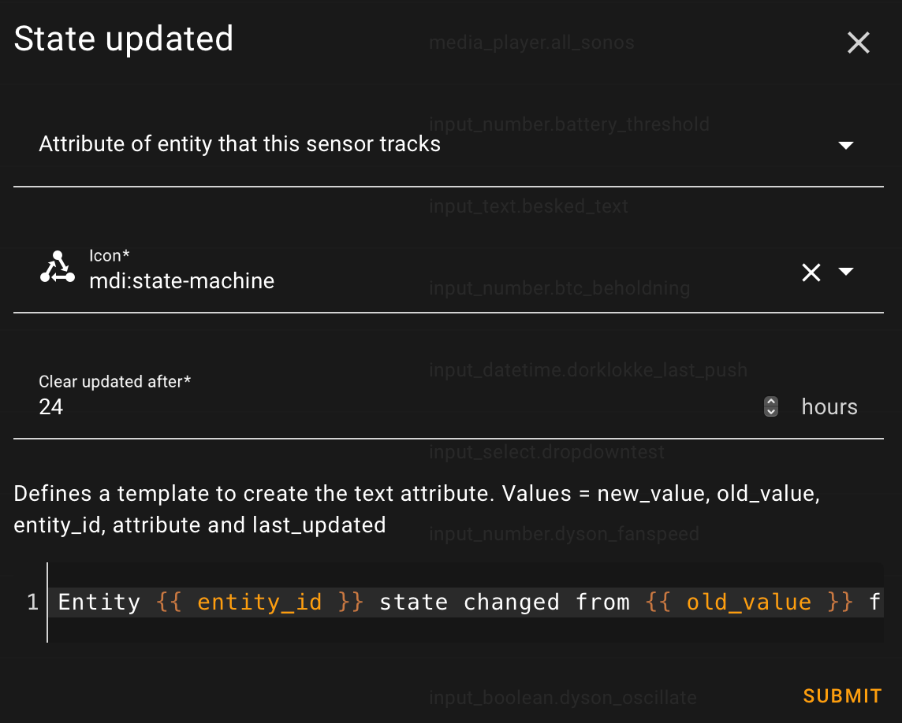

<!-- markdownlint-disable MD041 -->

# State updated helper

 
The State Updated Helper integration lets you create a binary sensor that monitors changes in another entity’s state or state_attributes. Whenever the monitored entity changes, the binary sensor is triggered and provides both the new and old values, which you can use in text templates for notifications or automations.
This makes it easy to track exactly what changed and when. After a user-defined time period, the binary sensor automatically resets, ready to detect the next change. This integration is ideal for monitoring important state changes and responding to them quickly and efficiently in your Home Assistant setup.

## installation

For installation search for State updated helper in HACS and download. Or click

State updated helper integration can be installed using HACS.
Search for `State updated` in *Integrations* section.

Add a new State updated helper integration to your Home Assistant instance, click

## Configuration

Configuration is done through the Home Assistant UI. To add a new entry, simply go to [Settings > Devices & Services > Helpers](https://my.home-assistant.io/redirect/helpers) and click the add button. Next choose the [State updated helper](https://my.home-assistant.io/redirect/config_flow_start?domain=state_updated) option.

<!---->
 
 

<!---->
 
 

| Field name | Mandatory/Optional | Description |
|------------|------------------|-------------|
| Name | Optional | Name. If empty, entity id name is used  |
| Entity id | Mandatory | Entity that this sensor tracks  |
| Attribute | Optional | Attribute of entity that this sensor tracks  |
| Icon | Mandatory | Icon used by entity  |
| Clear updates after | Mandatory | User defined time period indicating when to clear the entity  |
| Text template | Optional | Defines a template to create the text state attribute. Value = new_value, old_value, entity_id, attribute and last_updated |

## Exposed state attributes

The state updated helper integration provides the following state attributes.

| Attribute | Description |
|-----------|-------------|
| new_value  | New state/state_attribute value |
| old_value  | Old state/state_attribute value |
| text  | Text generated from template |
| last_updated  | Last time the state/state_attribute was updated |

## Actions

Available services: __reset__ and __reset_all__.

### Actions state_updated.reset

Reset a specific State Updated entity.

|Service data attribute | Optional | Description|
|-----------------------|----------|------------|
|entity_id | No | Name of the State updated entity to reset.|

### Action state_updated.reset_all

Reset all State updated entities.

## Usage scenario

Using the Scrape integration for retrieving latest software version. By letting the State updated helper monitor the Scrape entity, a card can be built that only shows when there are changes and an the content about what has changed.

### Support

If you like this integration or find it useful, please consider giving it a ⭐️ on GitHub 👍 Your support is greatly appreciated!
